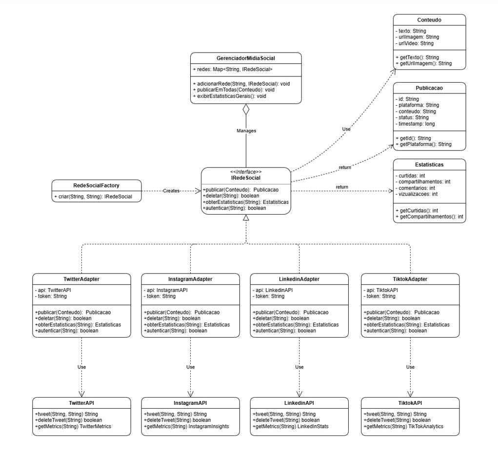

# Sistema de Integração de APIs de Mídia Social com Padrão Adapter

### Componentes Principais

1. **Modelos de Dados**
    - `Conteudo`: Representa o conteúdo a ser publicado
    - `Publicacao`: Resposta unificada de publicações
    - `Estatisticas`: Métricas padronizadas

2. **Interface Unificada**
    - `RedeSocialInterface`: Define contrato comum para todas as redes

3. **APIs Simuladas**
    - `TwitterAPI`, `InstagramAPI`, `LinkedInAPI`, `TikTokAPI`
    - Cada uma com sua própria estrutura e métodos

4. **Adapters**
    - `TwitterAdapter`, `InstagramAdapter`, `LinkedInAdapter`, `TikTokAdapter`
    - Traduzem chamadas unificadas para APIs específicas

5. **Factory**
    - `RedeSocialFactory`: Cria adapters dinamicamente

6. **Gerenciador**
    - `GerenciadorMidiaSocial`: Orquestra operações em múltiplas redes

## Diagrama de Classes


## Como Executar

### Pré-requisitos
- Java 8 ou superior
- Nenhuma dependência externa necessária

### Compilação e Execução

```bash
# Compilar
javac Main.java

# Executar'
java Main
```

## Padrões de Design Implementados

### 1. **Adapter Pattern**
- **Problema**: APIs diferentes com interfaces incompatíveis
- **Solução**: Adapters convertem interface de cada API para interface unificada
- **Benefício**: Cliente usa interface única, adapters encapsulam complexidade

### 2. **Factory Method Pattern**
- **Problema**: Criação complexa de objetos com configuração
- **Solução**: Factory centraliza lógica de criação e autenticação
- **Benefício**: Código cliente mais limpo, fácil adicionar novas plataformas

### 3. **Strategy Pattern** (implícito)
- **Implementação**: Cada adapter é uma estratégia diferente
- **Benefício**: Comportamento pode ser trocado em runtime

### Simplificações do Projeto
- APIs são simuladas (não fazem chamadas reais)
- Autenticação é mockada (tokens não são validados)
- Estatísticas retornam valores fixos para demonstração
- Não há persistência de dados